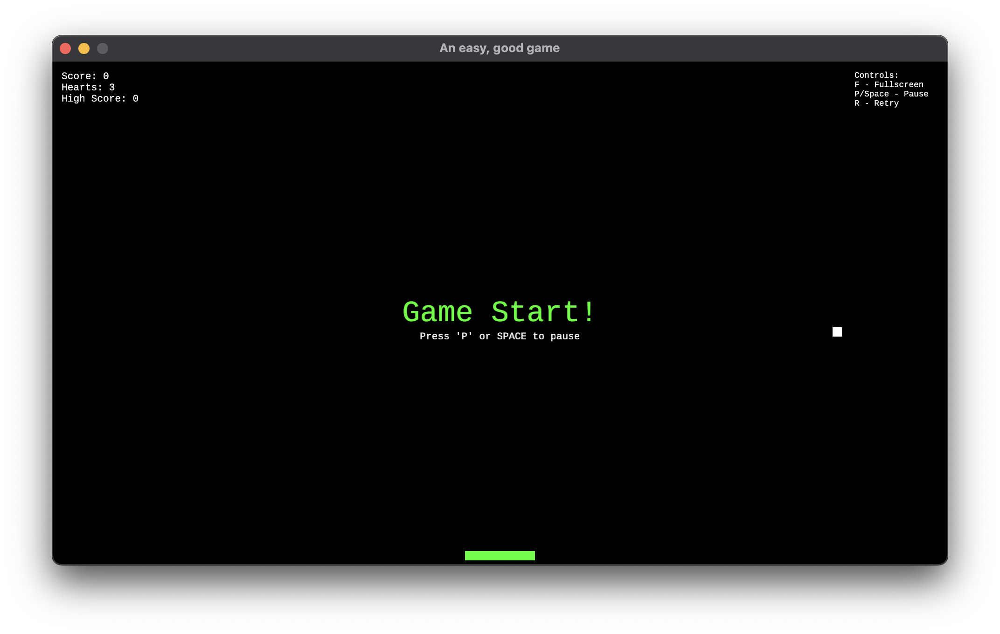
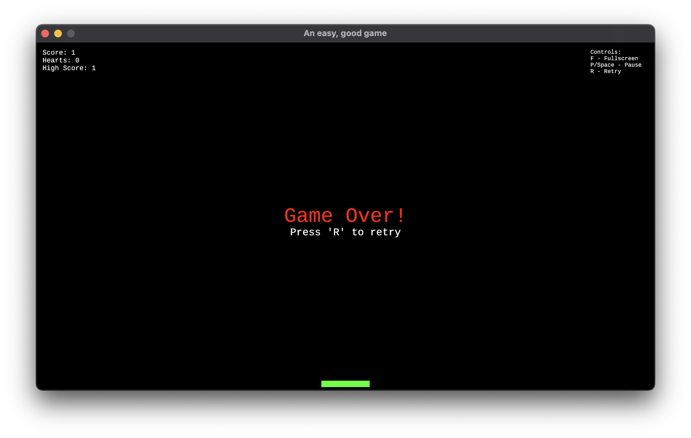

# BounceShield

[**Game Details**](docs/game-details.md)

## Problem Decomposition

The task is to create a simple ball-and-bar game where the player controls a bar to bounce a ball and avoid it falling off the screen. The game includes scoring, hearts, and increasing difficulty by adding milestones for extra hearts and bar width.

**Main Features**:
- **Ball Movement**: The ball moves across the screen and bounces off walls and the player's bar.
- **Bar Movement**: The player controls a bar that can move left or right to keep the ball in play.
- **Score System**: The player earns a score by bouncing the ball off the bar, with additional milestones that grant hearts.
- **Hearts**: The player starts with 3 hearts, which are lost when the ball falls off the screen. Losing all hearts ends the game.
- **Game Over**: The game ends when the player runs out of hearts, and the player can press "R" to restart.

- [x] Ball moves and bounces off walls and bar.
- [x] Player controls a bar using left and right arrow keys.
- [x] Score is updated when the ball bounces off the bar.
- [x] Hearts are deducted when the ball falls below the bar.
- [x] Milestones for awarding hearts and increasing bar width.
- [x] Game over when no hearts are left.

- **Controls**  
  - Use the **left** and **right** arrow keys to move the bar.
  - Press **R** to restart the game when it’s over.

### Screenshots

*The "Game Start".*

*The "Game Over" screen after losing all hearts.*

*The "Game Retry" screen after recording highscore.*

### Planned Features

[**coming soon**](docs/todo.md)

- **Power-ups**: Introduce power-ups such as speed boosts or extra hearts.
- **Levels**: Add multiple levels with increasing difficulty, where the ball moves faster or new obstacles appear.
- **Achievements**: Add achievements for milestones like a high score or consecutive levels cleared.

### Credits

- **Game Engine**: The game is built using the [macroquad](https://github.com/not-fl3/macroquad) game engine.
- **Assets**: Custom assets used for the game interface.

#### Usage Guide

- **Linting**  
  `cargo clippy`

- **Formatting**  
  `cargo fmt`

- **Autofix**  
  `cargo clippy --fix && cargo fmt`

- **Testing**  
  `cargo test`

- **Running the Game**  
  To run the game, use:  
  `cargo run --release`

---

## License

© 2024 Evans Chaba. All rights reserved.

This game is open-source and released under the MIT License. See [LICENSE](LICENSE) for more details.